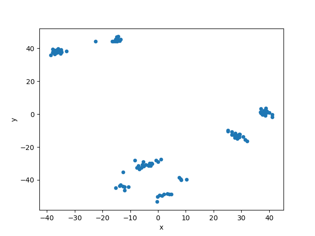
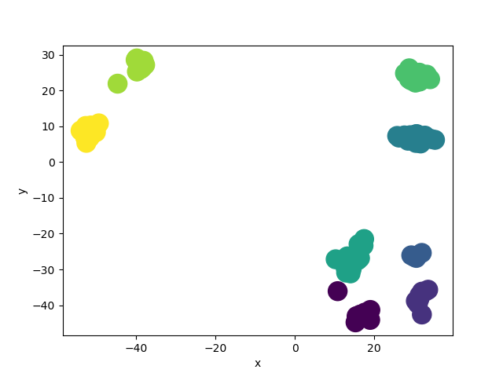

# This is an example of K Means clustering being used to identify the sources of a Hepatitus C outbreaks. The K Means part of this project was coded entirely from scratch with out the use of any K Means libraries.
It starts off by processing the data from the .fas file to where I have an array with each index containing a genome. Then it computes the hamming distance between each genome. I then run it through Multidimensional Scaling to get a scatterplot of of the data as well as a data frame for it. I used the scatter plot to determine that there are 8 cluster's in the data. 

With that knowledge I can then run the data frame through my K Means method. After completion the data frame will be returned with a new column containig the cluster that each data point belongs to. I then create another scatterplot but this time each point has a color corresponding to the cluster it belongs to.

